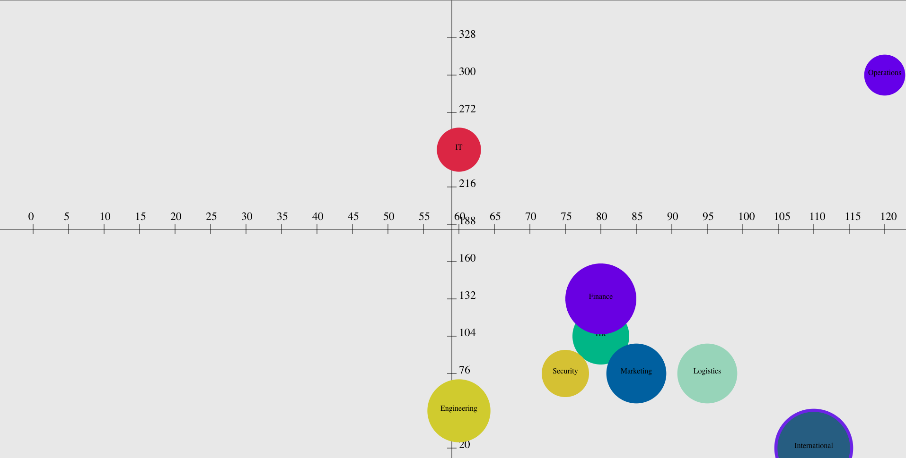

# Welcome to my assessment
In this assessment, I learnt lots because I wanted to build this pure css and components but I realized to position the bubbles it would be harder then it needs to be. So because of this I restarted and changed all the logic to use [Canvas Api](https://developer.mozilla.org/en-US/docs/Web/API/Canvas_API). It was difficult at first because I had never used it but after I got the hang of it the graph was much easier to build. One thing to notice is that the international bubble seems to have a border but it's actually showing to jobs that have the same coordinates just one has a bigger size.

## Picture of Bubble Graph

## Available Scripts

In the project directory, you can run:
### `npm start`

Runs the app in the development mode.\
Open [http://localhost:3000](http://localhost:3000) to view it in your browser.

The page will reload when you make changes.\
You may also see any lint errors in the console.